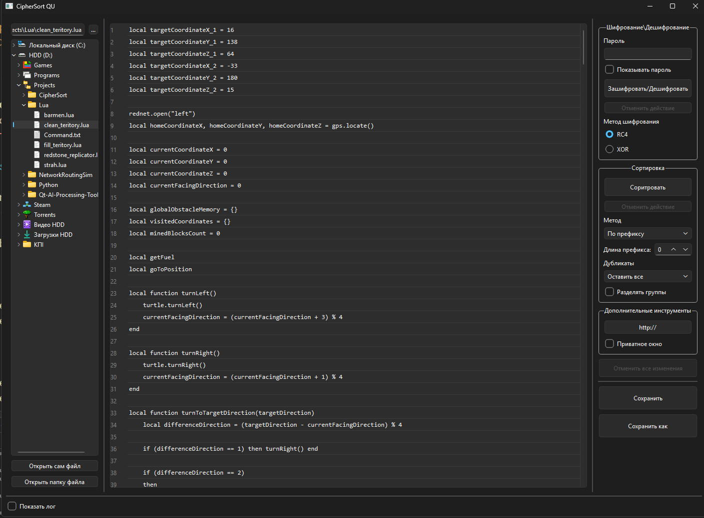
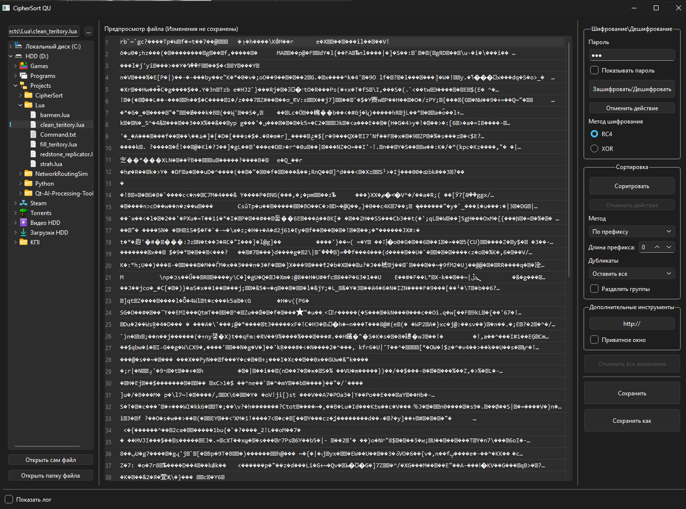

# CipherSort 🛡️🗂️

CipherSort is a powerful, cross-platform desktop application built with C++ and the Qt framework. It combines advanced text sorting, file cryptography, and smart link management into a single, intuitive graphical interface.

## Key Features

* **Interactive Table Editor:** View and edit text files directly in a structured table format with automatic background saving.
* **Advanced Sorting Engine:**
  * **Prefix Sort:** Group lines by the first `N` characters.
  * **Alphabetical & Hybrid:** Sort within groups or across the entire file.
  * **Smart Deduplication:** Keep all, delete duplicates, or move them neatly to the end of the file.
  * **Visual Formatting:** Optional visual headers and spacing for sorted groups.
* **Cryptography (RC4 / XOR):** Encrypt and decrypt file contents with a password. Includes a secure preview sandbox.
* **Smart Link Opener:** Select multiple table rows and open URLs simultaneously.
  * Supports bulk opening with a safe delay to prevent UI freezing.
  * **Incognito Mode:** Automatically detects and launches your preferred browser in private mode (Priority: Brave > Chrome > Opera > Opera GX > Edge).
* **Session Management:** Automatically remembers and loads your last opened file and directory tree.

## 🏗️ Architecture & Data Safety (Sandbox)

Unlike standard editors that modify files directly, CipherSort uses a multi-stage buffer system to ensure data integrity:

1. **Original File**: Stays untouched until the final "Save" command.
2. **Backup Buffer**: Created upon opening to allow a full "Revert to Original" state.
3. **Work Buffer**: The active layer for manual table edits.
4. **Action Buffers (Crypto/Sort)**: Independent temporary layers for processing results.

This architecture allows the user to perform complex operations, preview the results in the UI, and discard them instantly if the outcome is not as expected.

## 📈 Project Evolution: From CLI to GUI

CipherSort underwent a complete architectural overhaul to become a modern desktop application:

* **Legacy Removal**: Deleted over 1,000 lines of console-specific logic, manual navigators, and command-line parsers.
* **Qt Integration**: Replaced manual file system iterators with `QFileSystemModel` for native OS performance.
* **Modern C++**: Refactored the sorting and crypto engines into clean, modular features decoupled from the UI.

## ⚖️ Why CipherSort?

| Feature | Standard Notepad | CipherSort |
| :--- | :---: | :---: |
| **Structure** | Plain Text | Interactive Table |
| **Sorting** | Simple A-Z | Prefix, Hybrid, & Deduplication |
| **Privacy** | None | RC4/XOR Encryption |
| **Link Management** | Manual copy-paste | Bulk Open with Incognito Priority |
| **Data Safety** | Direct Overwrite | Sandbox & Preview System |

## 🛠️ Technologies Used
* **C++17**
* **Qt Framework** (QWidgets, QFileSystemModel, QProcess)
* **Standard Template Library (STL)**

## 🚀 How to Build

1. Clone the repository:
   ```bash
   git clone [https://github.com/LoPHarp/CipherSort.git](https://github.com/LoPHarp/CipherSort.git)
   ```
2. Open the project folder in **Qt Creator**.
3. Configure the project using your preferred compiler (e.g., MinGW or MSVC).
4. Build and Run.

## 📸 Screenshots

### Main Editor & File Navigation


### Secure Sandbox Preview (Sorting & Encryption)


## 🤝 Contributing
Feel free to fork this repository, submit pull requests, or open issues to discuss new features or bugs.